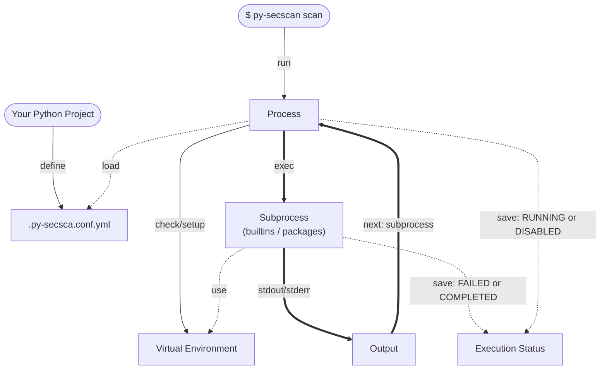

# PY SecScan


[](https://pypi.python.org/pypi/py-secscan)
[](https://pypi.python.org/pypi/py-secscan)
[](https://pypi.python.org/pypi/py-secscan)
[](https://github.com/astral-sh/uv/actions)
[](https://github.com/astral-sh/uv)

PySecScan is a lightweight and easy-to-use security scanning tool for Python projects. With a simple YAML configuration, it seamlessly integrates into any workflow, regardless of the framework or dependencies used. PySecScan automates security checks, linting, and SBOM generation, ensuring a proactive approach to code security with minimal setup.

## Table of Contents 📚

- [PY SecScan](#py-secscan)
  - [Table of Contents 📚](#table-of-contents-)
  - [Guide](#guide)
    - [Installation](#installation)
    - [Getting start](#getting-start)
    - [CLI](#cli)
    - [GitHub Actions](#github-actions)
    - [Pre-commit](#pre-commit)
  - [How It Works](#how-it-works)
    - [Configuration Schema](#configuration-schema)
    - [Virtual Environment](#virtual-environment)
    - [Subprocess](#subprocess)
  - [Usage](#usage)
    - [Enable `sbom_vulnerabilities`](#enable-sbom_vulnerabilities)
    - [View SBOM file](#view-sbom-file)
  - [Develop](#develop)
    - [Setup with Nix environment](#setup-with-nix-environment)
    - [Setup in Local Environment](#setup-in-local-environment)
    - [Tests](#tests)

## Guide

### Installation

1. Ensure you have Python 3.12 or higher installed on your system. You can download it from the [official Python website](https://www.python.org/downloads/).

2. Install PySecScan using pip or uv:

    ```bash
    pip install py-secscan

    # Or using uv
    uv add --dev py-secscan
    ```

### Getting start

1. Create a sample Python project and navigate to its root directory.

2. Define the `.py-secscan.conf.yml` configuration file like this:

    ```yaml
    version: "1"

    packages:
      - command_name: "echo"
        command_args: ["test"]
    ```

3. Run the security scan:

    ```bash
    py-secscan scan
    ```

4. Output

```plaintext
[INFO] Subprocess command: <path>/.venv/bin/python -m ensurepip --upgrade

[INFO] Subprocess command: <path>/.venv/bin/python -m pip install -r <path>/.py-secscan/requirements.txt

[INFO] Execute builtins packages
[INFO] Executing package ruff
[INFO] Subprocess command: ruff check --fix
All checks passed!

[INFO] Package ruff completed
[INFO] Executing package cyclonedx-py
[INFO] Subprocess command: cyclonedx-py environment --outfile sbom.json <path>/.venv

[INFO] Package cyclonedx-py completed
[WARNING] python package is disabled
[INFO] {'logger_filepath': '<path>/.py-secscan/logs/py-secscan.2025-02-12.log', 'status': {'ruff': 'completed', 'cyclonedx-py': 'completed', 'python': 'disabled'}}
[INFO] Execute packages
[INFO] Executing package echo
[INFO] Subprocess command: echo test
test

[INFO] Package echo completed
[INFO] {'logger_filepath': '<path>/.py-secscan/logs/py-secscan.2025-02-12.log', 'status': {'ruff': 'completed', 'cyclonedx-py': 'completed', 'python': 'disabled', 'echo': 'completed'}}
```

### CLI

The `py-secscan` command currently has the following options:

**`scan`**: Loads the `.py-secscan.conf.yml` configuration and executes the defined commands. The security scan is, of course, proportional to what you define. By default, a linting check is performed, and the SBOM file is generated.

**`view`**: Launches a web page based on Streamlit to visualize the SBOM and any detected vulnerabilities (if `builtins.sbom_vulnerabilities` is enabled). To use this command, you must install streamlit manually or via `pip install 'py-secscan[view]'` (recommended choice).

> You can increase the verbosity level using the `-v` and `-vv` options.

### GitHub Actions

> IN PROGRESS

### Pre-commit

> IN PROGRESS

## How It Works



The functionality of PySecScan is simple: using the `.py-secscan.conf.yml` configuration file, you can define the security scanning strategy for your project.

**Builtins**:

By default, the `py-secscan scan` command performs a project check using `ruff` and creates the SBOM file using `cyclonedx`. Additionally, you can enable `sbom_vulnerabilities` to scan each package listed in `sbom.json` using the OSV API.

**Packages**:

Once the builtins are executed, the scan retrieves the defined `packages` and runs them one by one (installing them in the virtual environment first if defined). **It is recommended to execute only Python packages related to security checks**, but any type of binary can be executed as it runs as a subprocess (be mindful of `FORBIDDEN_OPERATORS`, which prevent the execution of certain commands).

\* Package installation is limited to Python packages available on PyPI.

### Configuration Schema

The `.py-secscan.conf.yml` configuration file must contain at least the `version` key and is structured into several optional sections to customize `py-secscan`'s behavior. For more details view [jsonschema version 1](py_secscan/scan/parser/v1/pysecscan.schema.json)

**1. Version**:

- `version` (*required*): A string that defines the parser version to use. Currently supported versions: `1`.

**2. Options**:

- `debug` (*default: false | optional*): Enables debug mode.
- `env` (*default: {} | optional*): Dictionary of environment variables.
- `pysecscan_dirpath` (*default: ".py-secscan" | optional*): Path to the PySecScan directory.
- `venv_dirpath` (*default: ".venv" | optional*): Path to the virtual environment directory.
- `enabled` (*default: true | optional*): Enables/disables security checks.
- `disable_builtins` (*default: false | optional*): Disables all built-in commands.
- `disable_venv_check` (*default: false | optional*): Disables the virtual environment check, allowing execution in a non-virtual environment.
- `disable_venv_creation` (*default: false | optional*): Disables automatic virtual environment creation.
- `disable_venv_install` (*default: false | optional*): Disables the installation of packages defined in the `packages` directive in the virtual environment.
- `additional_forbidden_commands` (*default: [] | optional*): Additional list of forbidden commands that will be blocked.

**3. Packages**:

List of commands to execute.

- `command_name` (*required*): Name of the command to execute.
- `command_args` (*default: [] | optional*): List of string arguments to pass to the command.
- `install` (*default: {} | optional*):
  - `enabled` (*default: false | optional*): If true, the package will be installed automatically.
  - `package_name` (*default: "" | optional*): Used to define the package name for installation via `pip install <package_name>==<version>`. If not defined, it defaults to `command_name`.
  - `version` (*default: "latest" | optional*): Package version.
  - `extras` (*default: [] | optional*): Extra installation options.
- `enabled`: If false, the package will not be executed and will be marked as `DISABLED`.
- `on_error_continue`: If true, errors will not stop the execution of subsequent packages.

**4. Builtins**:

Builtins are predefined packages that can be enabled/disabled or configured differently at any time.

The `ruff` builtin automatically performs an initial linting check on the entire project.

- `ruff`:
  - `command_name`: "ruff"
  - `command_args`: ["check --fix"]
  - `enabled`: True
  - `on_error_continue`: False

The `cyclonedx` builtin automatically scans the virtual environment and generates an SBOM file containing all dependencies.

- `cyclonedx`:
  - `command_name`: "cyclonedx-py"
  - `command_args`: [
        "environment --outfile sbom.json <venv_path>"
    ]
  - `enabled`: True
  - `on_error_continue`: False

The `sbom_vulnerabilities` builtin, when enabled, scans for vulnerabilities in each dependency listed in the SBOM file using the [OSV](https://osv.dev/) API.

- `sbom_vulnerabilities`:
  - `command_name`: "python -m py_secscan.modules.builtins.sbom_vulnerabilities"
  - `command_args`: ["sbom.json sbom_vulnerabilities.json"]
  - `enabled`: False
  - `on_error_continue`: True

### Virtual Environment

A virtual environment (venv) must be present at the specified path and activated before executing the `py-secscan scan` command. Before execution, a check ensures that the correct venv is being used (default: `<project-path>/.venv`).

Once verified, all defined packages with `install.enabled: true` are installed. A `.py-secscan/requirements.txt` file is created, containing the list of packages installed at runtime by PySecScan.

This allows you to destroy the venv without worrying about losing installed packages since they will always be reinstalled based on the configuration.

> ⚠️ WARNING: Disabling the virtual environment check is possible but not recommended, as it could lead to installing packages globally. This should be used only in CI/CD contexts by setting `options.disable_venv_check` to `true`.

### Subprocess

As shown in the diagram, every execution of a `builtin` or `package` is a Python subprocess. The executed command is sanitized and checked to prevent harmful commands. Each execution status is recorded as `RUNNING`, `COMPLETED`, `FAILED`, or `DISABLED`.

## Usage

### Enable `sbom_vulnerabilities`

1. Add to the `.py-secscan.conf.yml` configuration:

    ```yaml
    ...

    builtins:
      sbom_vulnerabilities:
        enabled: true
    ```

### View SBOM file

1. After also enabling the built-in `sbom_vulnerabilities` and running the `py-secscan scan` command, two new files are created in the root of your project: `sbom.json` and `sbom_vulnerabilities.json`.
2. Run the command to view the SBOM files from a web page (remember, you must have py-secscan[view] installed):

    ```bash
    py-secscan view
    ```

## Develop

```bash
git clone https://github.com/FabrizioCafolla/py-secscan

cd py-secscan
```

### Setup with Nix environment

**Requirements:**

| Package | Version    | Install Guide |
| ------- | --------- | -------------- |
| devbox  | `>=0.12.0` | [docs](https://www.jetify.com/devbox/docs/installing_devbox/#install-devbox) |

**Steps:**

```bash
devbox shell
devbox run setup
```

### Setup in Local Environment

**Requirements:**

| Package | Version     | Install Guide |
| ------- | ---------- | -------------- |
| python  | `>=3.12.0` | [downloads](https://www.python.org/downloads/) |
| uv      | `>=0.4.3`  | [docs](https://docs.astral.sh/uv/getting-started/installation/) |

**Steps:**

```bash
uv venv --python 3.12
source .activate

uv sync --all-extras
uv run pre-commit install
uv run pre-commit run --all-files

py-secscan -v scan
```

### Tests

```bash
devbox run test

uv run pre-commit run --all-files
uv run pytest tests/*
py-secscan -vv scan
```
