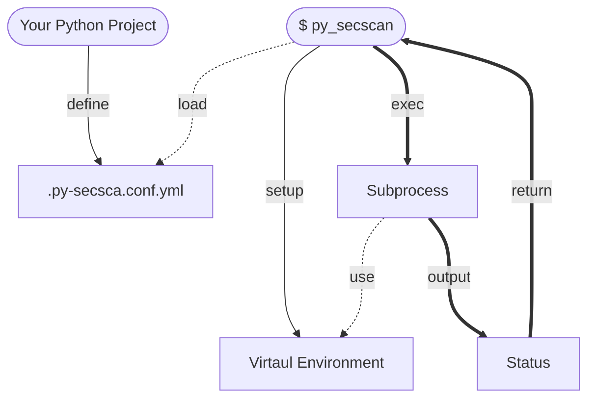

# PY SecScan

PySecScan is the tool that allows you to perform security scans in your Python project through a simple YAML configuration.

## Usage

### Local

1. Install package

    ```bash
    pip install py-secscan

    # Or using uv
    uv add --dev py-secscan
    ```

2. In your root project folder, define the `.py-secscan.conf.yml' configuration

    ```yaml
    packages:
      - name: "ruff"
        args: ["check", "--fix"]
    ```

3. Run command in your root project folder

    ```bash
    py_secscan
    ```

## How it works

- **Configuration**: The `.py-secscan.conf.yml` configuration defines the packages (and the options to pass to them) that will scan the source of your project.
- **Virtual environment**: On the first execution of the command, a virtual environment will be created (if it exists, it will use the existing one) and you will be asked to `source` the virtual environment if you haven't already. Once created and sourced, the command will create a `.py-secscan` folder (and add it to the `.gitignore` file) where the requirements file requested by the `.py-secscan.conf.yml` file will be saved and subsequently installed.
- **Execution**: By executing the `py_sescan` command in the root of your project, it will retrieve the defined configuration, and for each configured package, a dedicated **subprocess** will be executed.


```mermaid
flowchart TD
    A(["Your Python Project"]) -- define ---> C[".py-secsca.conf.yml"]
    PySecScan(["$ py_secscan"]) -. load ..-> C
    PySecScan -- setup --> Env
    PySecScan == exec ===> Subprocess
    Subprocess == output ===> Status
    Subprocess -. use ..-> Env["Virtaul Environment"]
    Status == return ===> PySecScan
```

## Develop

```bash
git clone https://github.com/FabrizioCafolla/py-secscan

cd py-secscan
```

### Setup with Nix environment

**Requirements:**

| pkg    | version    | install                                                                      |
| ------ | ---------- | ---------------------------------------------------------------------------- |
| devbox | `>=0.12.0` | [docs](https://www.jetify.com/devbox/docs/installing_devbox/#install-devbox) |

**Steps:**

1. Run `devbox shell`
2. Run `devbox run setup`

### Setup in local environment

**Requirements:**

| pkg    | version    | install                                                                      |
| ------ | ---------- | ---------------------------------------------------------------------------- |
| python | `>=3.12.0` | [downloads](https://www.python.org/downloads/) |
| uv | `>=0.4.3`| [docs](https://docs.astral.sh/uv/getting-started/installation/) |

**Steps:**

1. Run `uv venv --python 3.12`
2. Run `uv sync`
3. Run `uv run pre-commit install`
4. Run `uv run pre-commit run --all-files`
